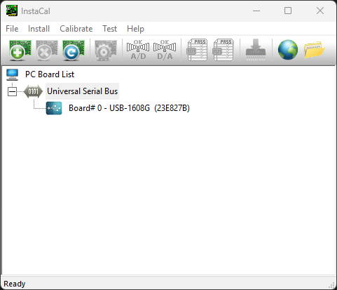
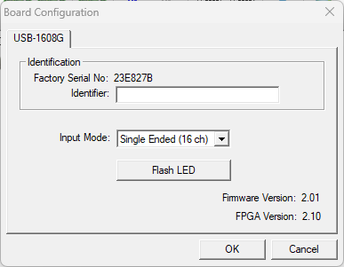

# 9999-DD-2004 Test Setup

## Overview
This document outlines the hardware setup for testing the 9999-DD-2004 PCB.
The PCB is an electrical circuit that generates an analog output signal via PWM
control of an open drain digital pin. This analog signal drives an opto-isolator
output with an LC filter. Finally there is a set of SSRs, one NO and one NC, that
allow a signal to pass through unmodified or use the output of the PWM LC circuit.

## Schematics
- 
- 

## Test Procedure
1. Plug in MCC Testing DAQ to laptop (Top LED should be illuminated to denote DAQ is powered up).
2. Open InstaCal to confirm board is identified correctly (Board Number 0).

  

3. Within InstaCal, confirm DAQ Input Mode is set to _Single Ended_.

  

4. Plug in board to DAQ test setup.
5. Open windows command prompt.
6. Enter CLI command to execute desired tests.
    - `pytest tests/9999-DD-2004 --serial-number=<SN> --part-number=<PN>`
7. Following test execution, an html test report shall be opened in a web browser.
    - Report is also saved to local `reports` directory as well as `report.html`.
    - Database results are included in the `db` directory as `results.db`.
